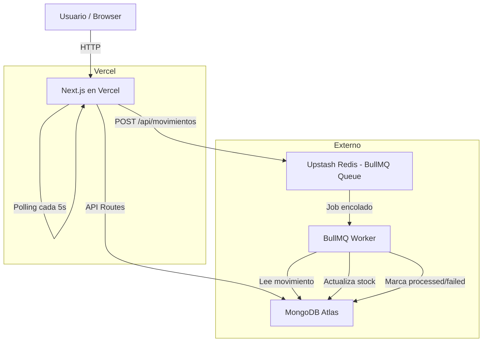

# PROCESS.md — StockFlow

## 1. Cómo abordé el problema

Lo primero que hice antes de escribir una sola línea de código fue leer el examen completo y entender qué se estaba pidiendo realmente. Identifiqué que el núcleo del problema no era el CRUD (eso es mecánico), sino el **procesamiento asíncrono de movimientos** con estados, reintentos y actualización de stock de forma confiable.

### Orden de decisiones:

1. **Primero definí la arquitectura:** Next.js monorepo en Vercel para simplificar el deploy. Un solo proyecto, una sola URL.
2. **Luego modelé los datos:** Las 4 entidades (Producto, Sucursal, Stock, Movimiento) y sus relaciones antes de tocar código.
3. **Después el backend:** Modelos → lib (mongodb, redis, worker) → API Routes.
4. **Finalmente el frontend:** Layout → páginas en orden de dependencia (productos → sucursales → movimientos → dashboard).
5. **Lo que dejé para el final:** README, PROCESS.md y el deploy del worker.

La decisión más importante al inicio fue **no empezar a codear de inmediato**. Definir los endpoints, los modelos y el flujo async antes de escribir código evitó refactorizaciones costosas.

---

## 2. Herramientas usadas

| Herramienta | Uso |
| --- | --- |
| **VS Code** | Editor principal |
| **Antigravity AI** | Asistente de desarrollo para acelerar la generación de código |
| **MongoDB Atlas** | Base de datos en la nube (M0 Free Tier) |
| **Upstash Redis** | Backend de BullMQ para la cola de jobs |
| **Vercel** | Deploy del frontend + API Routes |
| **GitHub** | Control de versiones y source para Vercel |
| **Node.js v24** | Runtime para el worker local |

---

## 3. Diagrama de arquitectura



### Flujo de un movimiento:

```
POST /api/movimientos
        ↓
Valida campos requeridos
        ↓
Crea Movimiento con estado: "pending"
        ↓
Encola job en BullMQ (Upstash Redis)
        ↓
Responde 201 al cliente inmediatamente
        ↓
[Worker en background]
        ↓
Recibe job → valida stock con operación atómica ($gte)
        ↓
Actualiza Stock en MongoDB
        ↓
Marca Movimiento como "processed"
        ↓ (si falla)
Reintenta 1 vez → si falla → marca "failed" con razonFallo
```

---

## 4. Las 3 decisiones técnicas más importantes

### Decisión 1: Next.js monorepo en Vercel

**Qué:** Usar Next.js con App Router para tener frontend y backend en un solo proyecto deployado en Vercel.

**Por qué:** El examen lo recomendaba explícitamente y tiene sentido técnico: un solo repositorio, un solo deploy, sin CORS que configurar, variables de entorno en un solo lugar.

**Trade-off:** Vercel es serverless, lo que significa que no puede correr procesos persistentes como el worker de BullMQ. Esto obliga a separar el worker en un servicio externo (Railway, Render, Fly.io) o correrlo localmente durante el desarrollo. Para producción real, el worker debería vivir en un contenedor Docker en un servicio que soporte procesos de larga duración.

---

### Decisión 2: BullMQ + Upstash Redis para procesamiento async

**Qué:** Usar BullMQ como sistema de colas con Upstash Redis como backend, en lugar de un simple `setTimeout`.

**Por qué:** Un `setTimeout` no es confiable: si el servidor se reinicia, los jobs pendientes se pierden. BullMQ persiste los jobs en Redis, garantiza al menos una ejecución, y soporta reintentos con backoff configurable. Upstash Redis tiene free tier y es compatible con BullMQ sin configuración adicional.

**Trade-off:** Agrega complejidad operacional (necesitas Redis además de MongoDB) y el worker no puede correr en Vercel. Para un sistema pequeño, un `setTimeout` podría ser suficiente. Para un sistema que integra con ERPs lentos (como describe el examen), BullMQ es la decisión correcta.

---

### Decisión 3: Operación atómica en MongoDB para evitar race conditions

**Qué:** En el worker, al decrementar stock usamos una query con condición `$gte` en el mismo `findOneAndUpdate`:

```js
Stock.findOneAndUpdate(
  { producto, sucursal, cantidad: { $gte: cantidadRequerida } },
  { $inc: { cantidad: -cantidadRequerida } },
  { returnDocument: 'after' },
);
```

**Por qué:** Si dos movimientos del mismo producto llegan al mismo tiempo, ambos podrían leer el stock disponible antes de que cualquiera lo actualice, causando stock negativo. Al poner la condición `$gte` dentro de la query, MongoDB garantiza que el decremento solo ocurre si hay suficiente stock **en el momento exacto de la escritura**, de forma atómica. Si el resultado es `null`, sabemos que el stock era insuficiente y el worker lanza un error para reintentar o marcar como `failed`.

**Trade-off:** Para escenarios de altísima concurrencia (miles de transacciones por segundo), se necesitaría una estrategia más robusta con transacciones de MongoDB o un sistema de reservas optimistas. Para el alcance de este proyecto, la operación atómica es suficiente y elegante.
