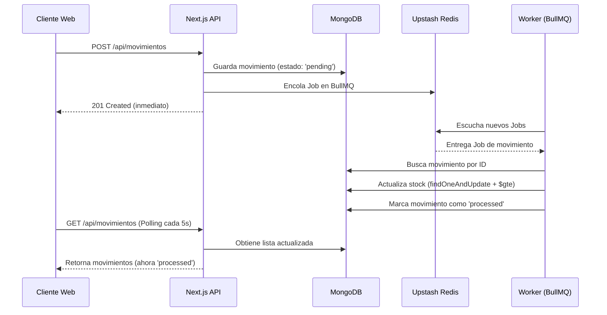

# 📦 StockFlow

**StockFlow** es una mini-plataforma de control de inventario multi-sucursal con soporte para procesamiento asíncrono de movimientos entre sucursales (entradas, salidas y transferencias). 

Este proyecto demuestra un sistema distribuido simple donde una aplicación web interactúa con una cola de trabajos en segundo plano para no bloquear el flujo de usuario durante operaciones de inventario, permitiendo un procesamiento robusto con reintentos y tolerancia a fallos.

---

## 🛠️ 2. Stack Tecnológico

*   **Frontend:** React, Tailwind CSS v4, Next.js (App Router)
*   **Backend:** Next.js API Routes (Serverless)
*   **Base de Datos:** MongoDB (Atlas) + Mongoose
*   **Procesamiento Asíncrono:** BullMQ + ioredis
*   **Cola de Mensajes:** Upstash Redis (Serverless)
*   **Cliente HTTP:** Axios
*   **Despliegue:** Vercel (Frontend & API)

---

## 🏗️ 3. Arquitectura del Sistema

El siguiente diagrama muestra el flujo asíncrono para el procesamiento de un movimiento (ej. transferencia de inventario).



---

## 📋 4. Requisitos previos

Para correr el proyecto localmente, necesitas tener instalado:

*   [Node.js](https://nodejs.org/) (v18.x o superior)
*   npm, yarn, pnpm o bun
*   Una cuenta en [MongoDB Atlas](https://www.mongodb.com/cloud/atlas) (M0 Free Tier es suficiente)
*   Una cuenta en [Upstash](https://upstash.com/) para una base de datos Redis Serverless

---

## 🔑 5. Variables de entorno necesarias (.env.local)

Crea un archivo `.env.local` en la raíz del proyecto. **Nunca subas este archivo a control de versiones.**

```env
# Conexión a MongoDB (crea un cluster en Atlas)
MONGODB_URI=mongodb+srv://<usuario>:<contraseña>@cluster0.xxxxx.mongodb.net/stockflow?retryWrites=true&w=majority

# Conexión a Upstash Redis (para la cola de BullMQ)
# Asegúrate de usar 'rediss://' (con doble s) para indicar TLS
UPSTASH_REDIS_URL=rediss://default:<TU_TOKEN>@us1-xxxxx-xxxxx.upstash.io:6380
```

---

## 🚀 6. Instrucciones de setup local paso a paso

1.  **Clonar el repositorio** e instalar dependencias:
    ```bash
    git clone <url-del-repositorio> stockflow
    cd stockflow
    npm install
    ```

2.  **Configurar variables de entorno:**
    Crea tu `.env.local` con las credenciales de tu MongoDB y Redis de Upstash (ver sección 5).

3.  **Iniciar el servidor de desarrollo (Next.js):**
    ```bash
    npm run dev
    ```
    La aplicación estará disponible en `http://localhost:3000`.

---

## ⚙️ 7. Cómo correr el worker localmente

Dado que las operaciones de stock se procesan de forma asíncrona, necesitas correr el worker en una terminal separada al mismo tiempo que la aplicación web.

Abre una **segunda terminal**, asegúrate de estar en la raíz del proyecto y ejecuta:

```bash
npm run worker
```

> **Nota:** Este comando ejecutará el script definido en el `package.json` (`node lib/worker.js`). El worker cargará las variables de `.env.local` y se quedará escuchando a BullMQ a través de Upstash Redis para procesar cualquier movimiento.

---

## 📡 8. Endpoints de la API documentados

La API está construida usando Next.js Route Handlers. Todas devuelven JSON.

### Productos
*   `GET /api/productos` - Lista todos los productos (orden desc.).
*   `POST /api/productos` - Crea un producto (requiere `sku`, `nombre`, `precio`, `categoria`).
*   `GET /api/productos/:id` - Obtiene detalle de un producto.
*   `PUT /api/productos/:id` - Actualiza parcialmente un producto.
*   `DELETE /api/productos/:id` - Elimina un producto.

### Sucursales
*   `GET /api/sucursales` - Lista todas las sucursales.
*   `POST /api/sucursales` - Crea una sucursal (requiere `nombre`, `ubicacion`).
*   `GET /api/sucursales/:id` - Obtiene detalle de una sucursal.
*   `PUT /api/sucursales/:id` - Actualiza parcialmente una sucursal.
*   `DELETE /api/sucursales/:id` - Elimina una sucursal.

### Stock
*   `GET /api/stock` - Lista el inventario cruzado de producto y sucursal. 
    *   *Filtros opcionales:* `?sucursal=<id>`, `?producto=<id>`.

### Movimientos
*   `GET /api/movimientos` - Lista el historial de movimientos.
    *   *Filtros opcionales:* `?estado=<pending|processed|failed>`, `?sucursal=<id>`.
*   `POST /api/movimientos` - Crea un movimiento (`entrada`, `salida`, `transferencia`). Queda en `pending` y se encola en BullMQ.
*   `GET /api/movimientos/:id` - Obtiene el detalle profundo (populate) de un movimiento.

### Reportes
*   `GET /api/reportes?desde=YYYY-MM-DD&hasta=YYYY-MM-DD` - Retorna un reporte de movimientos agregados por tipo y por sucursal en un rango de fechas.

---

## 🧠 9. Decisiones de arquitectura y trade-offs

### Por qué Next.js en lugar de un backend (Express) separado
El patrón *Backend for Frontend (BFF)* que ofrece Next.js nos permite iterar muy rápido y tener todo el proyecto en un monolito unificado. Nos evitamos lidiar con CORS, podemos compartir tipos/modelos y reducimos la complejidad de despliegue (se hace un solo push a Vercel en lugar de coordinar repositorios separados).

### Por qué BullMQ + Upstash Redis
Para no bloquear el hilo de ejecución HTTP durante operaciones críticas de negocio (actualización atómica del inventario), movemos ese peso a un background worker. Upstash ofrece un Redis Serverless excelente para emparejar con Vercel. BullMQ es el estándar en el ecosistema Node.js por su robustez, manejo de reintentos con backoff y resiliencia de Jobs.

### Un solo registro para transferencias
En lugar de crear dos movimientos (una salida y una entrada conectadas), modelamos la `transferencia` como un único documento que guarda una `sucursalOrigen` y una `sucursalDestino`.
*   *Ventaja:* Evita la complejidad transaccional a nivel de capa de datos para garantizar que no queden "huérfanas" las salidas si falla la entrada. Si el worker falla a la mitad, puede revertir la operación o marcarla como `failed` con un registro unificado.

### Trade-off del Worker en Vercel vs. Producción
Vercel es un entorno serverless (las funciones "mueren" tras dar respuesta). Un Worker de BullMQ necesita ser un proceso de larga duración (long-running) que siempre esté escuchando a Redis. 
*   **En Desarrollo:** Corremos `npm run worker` en una terminal local.
*   **En Producción:** No podemos hostear el worker dentro de Vercel. En un entorno real, la API y el Frontend viven en Vercel, pero el archivo `worker.js` tendría que empaquetarse (ej. en Docker) y desplegarse en un servicio persistente como **Railway**, **Render**, o **AWS ECS**, apuntando a la misma base de datos MongoDB y al mismo Upstash Redis.

---

## 🌐 10. URL de Producción

Puedes ver la interfaz desplegada en Vercel aquí:
🔗 **[https://stockflow-topaz-eight.vercel.app](https://stockflow-topaz-eight.vercel.app)**

> *(Nota: si el worker no está corriendo en un servicio separado persistente, los nuevos movimientos que crees se quedarán con estado `pending`)*

---

## ⏳ 11. ¿Qué haría diferente si tuviera una semana en vez de 48h?

Si dispusiera de más tiempo, abordaría la arquitectura y el producto en mayor profundidad:

1.  **TypeScript Absoluto:** Migraría el código de JavaScript puro a TypeScript estricto. Compartir interfaces de Zod o DTOs entre los Server Components, Route Handlers y el Worker prevendría muchísimos errores en tiempo de ejecución.
2.  **Transacciones Reales en MongoDB:** Si bien implementamos validaciones atómicas con `$gte` y "rollbacks lógicos" en caso de falla en el Worker, una aplicación crítica de dinero/inventario requiere `session.withTransaction()` de MongoDB Replica Sets para transacciones ACID genuinas en las transferencias de múltiples documentos.
3.  **Arquitectura de UI (Tailwind + Shadcn/UI):** Refactorizaría los componentes crudos por una librería de componentes estandarizada como Shadcn/UI para mejorar la consistencia visual y la accesibilidad (WAI-ARIA).
4.  **Autenticación y Autorización:** Integraría NextAuth.js para tener control de roles (Ej. un Vendedor puede registrar salidas pero no editar el catálogo de productos; el Gerente puede ver todo).
5.  **Tests Unitarios e Integración:** Crearía un suite de Jest o Vitest para el Worker, validando que el inventario nunca pueda ser negativo, asegurando la consistencia transaccional, y Cypress o Playwright para flujos E2E clave.
6.  **Despliegue Completo:** Subiría el Worker.js a Railway mediante un Dockerfile automatizado con GitHub Actions para asegurar un pipeline CI/CD de punta a punta.
